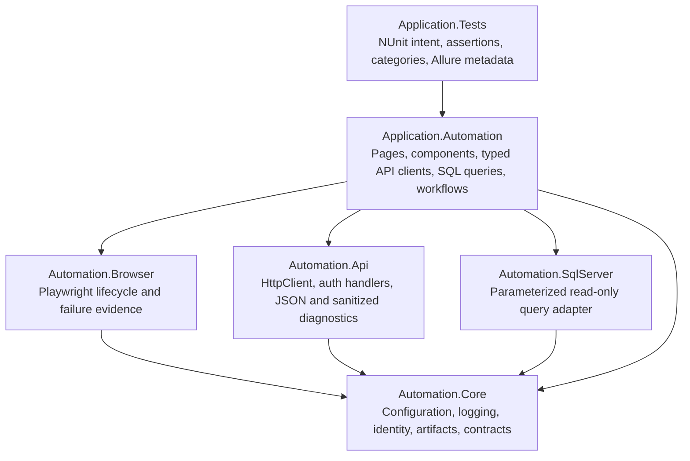

# AI Implementation Guide: Reusable .NET Test Automation Framework

> **Design baseline.** This is the requirements and design specification the framework is built
> against. Source comments and ADRs cite its numbered sections (e.g. "guide section 7.2"). It is the
> authoritative reference for *why* a rule exists; `AGENTS.md` and the other `docs/` files are the
> day-to-day operational guides. Keep this document and the code in sync — when a framework rule
> changes, update the relevant section here and the citing comment together.

## 1. Purpose

Build a reusable GitHub template repository for browser, REST API, read-only Microsoft SQL Server, and end-to-end tests. The repository must be understandable and safely maintainable by human engineers, OpenAI Codex, and Claude Code.

This is a template, not an application-specific test suite. Framework mechanics must remain separate from generated-project code and product-specific behavior.

Normative words have their usual meaning:

- **MUST** and **MUST NOT** are required.
- **SHOULD** is the preferred default; exceptions require a documented reason.
- **MAY** is optional.

## 2. Required clarification before implementation

Do not infer the following values. Use placeholders until the owner answers them. A generated repository is not release-ready while required values remain unresolved.

| Question | Required for scaffold? | Required before real tests? | Placeholder |
|---|---:|---:|---|
| Template repository name and default root namespace | Yes | Yes | `Company.Product.Automation` |
| Web application Test URL | No | Yes | `https://test.example.invalid` |
| REST API Test base URL | No | Yes | `https://api.test.example.invalid` |
| Bearer token acquisition and rotation process | No | Yes | GitHub secret / .NET user-secret |
| SQL Server address, database, encryption and authentication mode | No | Yes | external secret; never commit |
| Initial smoke feature and expected business outcome | No | Yes | sample tests remain explicitly skipped |
| GitHub Pages deployment branch and protection policy | Yes | Yes | GitHub Pages environment |
| Scheduled run days, local time and IANA timezone | No | Before schedule is enabled | schedule remains commented out |
| Required network path from GitHub-hosted runners to Test systems | Yes | Yes | validate before runner selection is finalized |

If a question affects architecture, security, external state, or product meaning, stop and ask. Do not “make a reasonable guess” that becomes permanent code.

## 3. Approved design contract

| Area | Approved choice | Required consequence |
|---|---|---|
| Runtime | .NET 10 LTS | Pin SDK in `global.json`; enable nullable reference types and warnings as errors. |
| Browser | Microsoft Playwright for .NET | Support Chromium, Firefox, and WebKit; Chromium is the routine default. |
| Test runner | NUnit | Use categories, parallel execution, and independent fixtures/tests. |
| API | `HttpClient` / `IHttpClientFactory` | Keep API execution independent from browser sessions; bearer token is the initial auth strategy. |
| Database | Microsoft SQL Server | Expose parameterized, read-only query operations only; no public DML or raw connection API. |
| Environment | Test only | CI has no environment selector. URLs and secrets vary by generated application. |
| Reporting | Allure Report 3 | Publish static HTML to GitHub Pages and preserve history between runs. |
| Logs | Microsoft logging abstractions with NLog | Emit readable console logs and per-test JSON Lines files. |
| CI | GitHub Actions | Manual dispatch first; a disabled schedule example is included and documented. |
| Preferred runner | Ubuntu 24.04 | Use Windows 2025 only for Windows-specific dependencies, authentication, certificates, or network needs. |
| AI support | Codex and Claude Code | Use shared architecture rules, deterministic scripts, structured artifacts, and evidence-led debugging. |

## 4. Non-goals

- No production-environment execution.
- No database inserts, updates, deletes, merges, schema changes, or stored-procedure execution.
- No runtime self-healing locators or silent test rewrites.
- No assertions inside Page Objects, API clients, query adapters, or framework infrastructure.
- No automatic external LLM calls from CI. AI diagnosis remains interactive and uses workflow artifacts.
- No automatic retry of assertion failures or ordinary HTTP failures. Any narrowly scoped transient retry policy must be explicit and observable.
- No committed credentials, tokens, cookies, connection strings, or secret response bodies.

## 5. Architecture



### 5.1 Dependency rules

- Dependencies flow down only.
- `Automation.Core` MUST NOT reference Browser, API, SQL Server, application, or test projects.
- Framework projects MUST NOT contain product selectors, endpoints, SQL, test intent, or assertions.
- `Application.Automation` MAY combine browser, API, and SQL capabilities into typed business workflows.
- `Application.Tests` owns NUnit assertions and execution metadata.
- Reusable framework projects SHOULD remain extractable into internal NuGet packages later without moving application code.

### 5.2 Module ownership

| Module | Owns | Must not own |
|---|---|---|
| `Automation.Core` | Validated configuration, logging contracts, test/run identity, artifact paths, redaction, common exceptions | Product selectors, endpoints, queries, assertions |
| `Automation.Browser` | Playwright startup, browser/context options, screenshots, traces, console collection | Business Page Objects, product assertions |
| `Automation.Api` | `IHttpClientFactory`, auth handlers, serialization, timing, sanitized request/response evidence | Product endpoints, API assertions |
| `Automation.SqlServer` | Connection creation, parameterized queries, mapping, safe query evidence | DML, schema changes, product SQL, raw connection exposure |
| `Application.Automation` | Pages, components, typed clients, reviewed query files, cross-channel workflows | NUnit assertions, runner setup |
| `Application.Tests` | Fixtures, intent, assertions, categories, test data, Allure hierarchy | Reusable framework mechanics |

## 6. Repository structure

```text
/
|-- .github/workflows/
|   |-- validate.yml
|   `-- test-and-report.yml
|-- .template.config/template.json
|-- .agents/skills/
|   |-- write-tests/SKILL.md
|   `-- debug-tests/SKILL.md
|-- .claude/skills/
|   |-- write-tests/SKILL.md
|   `-- debug-tests/SKILL.md
|-- docs/
|   |-- architecture.md
|   |-- configuration.md
|   |-- test-standards.md
|   `-- debugging.md
|-- scripts/
|   |-- Install-Playwright.ps1
|   |-- Invoke-Tests.ps1
|   |-- Generate-Allure.ps1
|   `-- Validate-Template.ps1
|-- src/
|   |-- Automation.Core/
|   |-- Automation.Browser/
|   |-- Automation.Api/
|   |-- Automation.SqlServer/
|   `-- Application.Automation/
|       |-- Pages/
|       |-- Components/
|       |-- Api/
|       |-- Database/Queries/
|       `-- Workflows/
|-- tests/Application.Tests/
|   |-- Fixtures/
|   |-- UI/
|   |-- API/
|   |-- Database/
|   `-- E2E/
|-- AGENTS.md
|-- CLAUDE.md
|-- Directory.Build.props
|-- Directory.Packages.props
|-- global.json
|-- package.json
|-- package-lock.json
`-- AutomationTemplate.slnx
```

The repository SHOULD be both a GitHub template and a .NET custom template. Generated repositories MUST record a `TEMPLATE_VERSION`. The template SHOULD publish tagged releases, a changelog, and upgrade guidance because GitHub template changes do not propagate automatically.

## 7. Cross-cutting contracts

### 7.1 Test identity

Every test run MUST produce a stable `RunId`. Every test MUST have a filesystem-safe `TestId`. All artifacts and structured events must include enough identity to map them to one run and test.

Minimum context:

- `RunId`
- `TestId`
- fully qualified test name
- type and suite
- browser or `not-applicable`
- worker number
- Git commit and GitHub run identifiers when available
- UTC timestamp

### 7.2 Artifact layout

```text
artifacts/
`-- <run-id>/
    |-- run-manifest.json
    |-- test-results.trx
    `-- tests/
        `-- <test-id>/
            |-- test-log.jsonl
            |-- screenshot.png
            |-- trace.zip
            |-- page.html
            |-- browser-console.jsonl
            |-- api-evidence.json
            `-- sql-evidence.json
allure-results/            # top-level, repository root (see below)
```

Create only the artifacts relevant to the test. Heavy video or HAR capture is opt-in.

> **Implemented exception (ADR 0001).** `allure-results/` lives at the **repository root**, not
> nested under `artifacts/<run-id>/`. Allure's tooling and the section 14 durable-history flow assume
> a single, stable, cleanable results directory, and the section 15.3 manifest example already uses a
> top-level path. See [`docs/decisions/0001-artifact-and-allure-layout.md`](decisions/0001-artifact-and-allure-layout.md).
> Everything else stays under `artifacts/<run-id>/`.

### 7.3 Redaction

Redaction MUST happen before writing logs or attachments. At minimum redact:

- `Authorization`, proxy authorization, cookies, and bearer tokens
- SQL connection strings and credentials
- configured secret JSON fields
- secrets in query parameters or request bodies

Do not rely on GitHub masking as the primary control.

## 8. Browser automation rules

### 8.1 Lifecycle

1. NUnit resolves and validates Test-environment configuration.
2. Playwright MAY reuse a browser process, but every UI test receives a new `BrowserContext` and `IPage`.
3. Tests construct application Page Objects from the isolated page.
4. Playwright auto-waiting and web-first assertions handle synchronization.
5. Teardown captures evidence before disposing the context.

### 8.2 Object model and locators

- Locator preference: role, label, placeholder, text, test ID, stable CSS; XPath last.
- Page Objects model a whole page. Component objects model reusable regions such as navigation, tables, or dialogs.
- Public methods express user behavior, not low-level click sequences.
- Page Objects and components MUST NOT make NUnit assertions.
- Fixed sleeps and implicit waiting MUST NOT be introduced for synchronization.
- Runtime self-healing MUST NOT replace a locator or alter test intent.

### 8.3 Failure evidence

| Evidence | Default |
|---|---|
| Full-page screenshot | Failure only |
| Playwright trace | Failure only |
| Current URL | Failure only |
| Browser console errors | Always; full console on failure |
| Page HTML | Failure only |
| Video / HAR | Explicit opt-in |

## 9. REST API rules

### 9.1 Framework contracts

```csharp
public interface IApiClient
{
    Task<ApiResponse<T>> SendAsync<T>(
        HttpRequestMessage request,
        CancellationToken cancellationToken = default);
}

public interface ITokenProvider
{
    ValueTask<string> GetAccessTokenAsync(
        CancellationToken cancellationToken = default);
}
```

Recommended supporting types: `BearerTokenHandler`, `ApiResponse<T>`, and `ApiRequestDiagnostics`.

### 9.2 Guardrails

- Use `IHttpClientFactory` and `System.Text.Json`.
- Authentication belongs in a delegating handler, not mutable shared default headers.
- Use cancellation tokens and explicit timeouts.
- Keep product endpoints and DTOs in `Application.Automation/Api`.
- Return enough response data for test assertions; do not assert inside the client.
- Record method, sanitized URL, status, elapsed time, correlation ID, and bounded sanitized body evidence on failure.
- Browser `APIRequestContext` MAY be used only when a test deliberately shares browser authentication or state.

## 10. SQL Server safety model

### 10.1 Public surface

```csharp
public interface IReadOnlySqlClient
{
    Task<IReadOnlyList<T>> QueryAsync<T>(
        SqlQuery query,
        CancellationToken cancellationToken = default);

    Task<T?> QuerySingleOrDefaultAsync<T>(
        SqlQuery query,
        CancellationToken cancellationToken = default);

    Task<T?> ScalarAsync<T>(
        SqlQuery query,
        CancellationToken cancellationToken = default);
}
```

`SqlQuery` MUST separate SQL text from named parameter values. Callers MUST NOT interpolate values into SQL text.

### 10.2 Defense in depth

1. Use a dedicated database identity granted only the required `SELECT` permissions.
2. Set `ApplicationIntent=ReadOnly` where compatible. Treat this as routing intent, not authorization.
3. Expose query methods only; keep `SqlConnection` and optional Dapper details internal.
4. Keep product SQL in reviewed `.sql` resources.
5. Reject multiple batches and unsupported command forms before execution.
6. Log only query ID, elapsed time, row count, and redacted parameter names.

Test setup and cleanup MUST use supported application APIs. Database access verifies state; it does not create, repair, or remove state.

## 11. Configuration and secrets

Configuration precedence, lowest to highest:

1. committed non-secret `appsettings.json`
2. local .NET user-secrets
3. GitHub Environment variables and secrets
4. validated command inputs

Suggested strongly typed options:

- `TestEnvironmentOptions` with fixed name `Test`
- `BrowserOptions`
- `ApiOptions`
- `SqlServerOptions`
- `ArtifactOptions`
- `RedactionOptions`

Validate all options before the first test. URLs may be placeholder values in the template, but sample integration tests must skip with an explicit reason until configured.

| Setting | GitHub location | Secret |
|---|---|---:|
| Web base URL | Test Environment variable | No |
| API base URL | Test Environment variable | No |
| API bearer token | Test Environment secret | Yes |
| SQL connection string | Test Environment secret | Yes |
| Environment name | Fixed value `Test` | No |

## 12. Test classification and execution

Every test has exactly one type:

- `UI`
- `API`
- `Database`
- `E2E`

Every test has at least one suite:

- `Smoke`
- `Regression`

Feature categories use `Feature:<name>`. Allure hierarchy uses stable `Epic`, `Feature`, and `Story` values independent of execution categories.

Tests MUST run alone, in any order, and in parallel. Each test owns unique data and unique artifact paths. No test may depend on another test's browser session, side effects, database writes, or artifact directory.

### 12.1 Stable command interface

The following command surface is a design contract. Implement the scripts so humans and agents invoke the same path locally and in CI.

```powershell
pwsh ./scripts/Invoke-Tests.ps1 -Type UI -Suite Smoke -Browser chromium -Workers 4
pwsh ./scripts/Invoke-Tests.ps1 -Type API -Suite Regression -Workers 4
pwsh ./scripts/Invoke-Tests.ps1 -Type Database -Suite Smoke -Workers 2
pwsh ./scripts/Invoke-Tests.ps1 -Type E2E -Suite Smoke -Browser chromium -Workers 2
pwsh ./scripts/Invoke-Tests.ps1 -TestName CustomerCanUpdateAddress
npm run allure:generate
```

The script MUST validate enum-like inputs before composing a filter. Never concatenate arbitrary workflow input into a shell command or NUnit expression.

## 13. GitHub Actions design

### 13.1 `validate.yml`

Triggers: pull request and push to the main branch.

Responsibilities:

- restore locked .NET and npm dependencies
- build Release with warnings as errors
- run analyzers and unit/structural tests
- discover NUnit tests
- validate categories and template tokens
- use no Test secrets

### 13.2 `test-and-report.yml`

Primary trigger: `workflow_dispatch`.

Manual inputs:

| Input | Allowed values | Default |
|---|---|---|
| `runner` | `ubuntu-24.04`, `windows-2025` | `ubuntu-24.04` |
| `browser` | `chromium`, `firefox`, `webkit`, `all` | `chromium` |
| `type` | `ui`, `api`, `database`, `e2e`, `all` | `all` |
| `suite` | `smoke`, `regression`, `all` | `smoke` |
| `tags` | validated comma-separated categories | empty |
| `parallelism` | `1`, `2`, `4`, `8` | `4` |

Workflow order:

1. Validate inputs.
2. Restore locked dependencies and build Release.
3. Install only selected Playwright browsers when the chosen type requires them.
4. Run isolated NUnit tests and retain their exit status.
5. Always collect Allure results, TRX, JSONL logs, screenshots, traces, and the run manifest.
6. Always generate the Allure 3 static report when results exist.
7. Update durable history through a serialized, narrowly permissioned job.
8. Deploy the latest report through official GitHub Pages artifact/deployment actions.
9. Return the original test result so reporting cannot convert a failed run to a pass.

Use `concurrency` to prevent two runs from racing when updating Pages or history.

### 13.3 Disabled schedule example

GitHub cron is UTC and does not accept an IANA timezone. Keep the schedule commented until the owner chooses days, local time, and timezone and the UTC conversion is documented.

```yaml
# Enable only after choosing and documenting the schedule and timezone.
# on:
#   schedule:
#     - cron: "0 18 * * 1-5" # EXAMPLE ONLY; UTC
```

When enabled, a scheduled run uses one browser: Chromium. It should call the same validated command path as manual runs.

### 13.4 Runner recommendation order

1. **Ubuntu 24.04** — default for Chromium, Firefox, WebKit, REST, and SQL over TCP.
2. **Windows 2025** — use for Windows Integrated Authentication, native Windows dependencies, enterprise certificates, installed browser channels, or confirmed network requirements.
3. **Self-hosted** — only when the Test application or SQL Server cannot be reached from GitHub-hosted runners or another explicit requirement demands it.

## 14. Allure Report 3

Pin the Node.js major version and the Allure 3 npm dependency. Commit `package-lock.json` and use `npm ci`.

Required outputs:

| Output | Destination | Contents |
|---|---|---|
| Human report | GitHub Pages | Latest Allure 3 HTML report, hierarchy, trends, and failure attachments |
| Diagnostics bundle | Workflow artifact | Raw Allure results, TRX, NLog JSONL, screenshots, traces, page HTML, run manifest |
| History state | Dedicated orphan history branch or equivalently durable store | Single Allure 3 `history.jsonl` |
| Agent summary | Workflow artifact/local output | Allure Agent Mode Markdown and evidence index when supported by the pinned version |

Durable history flow:

1. Clean `allure-results` before each independent test launch.
2. Restore `history.jsonl`; a missing file means the first run.
3. Generate the report with its history path pointing at that file.
4. Update the file from a serialized job with narrow permissions.
5. Deploy the generated static report.
6. Preserve the original test exit status.

Do not implement the Allure 2 pattern that copies a `history` directory into `allure-results`.

## 15. AI-friendly repository contract

### 15.1 Canonical instruction surfaces

- `AGENTS.md` is the primary operational guide for Codex and compatible agents.
- `CLAUDE.md` is a thin Claude Code entry point and links to the same shared documents.
- Tool-specific skills wrap one canonical workflow; they must not duplicate or contradict architecture rules.
- Exact commands live in shared documentation and scripts, not only in prompts.

### 15.2 Evidence-led debugging loop

1. Read `run-manifest.json`, the Allure result, and the agent summary.
2. Inspect the relevant trace, screenshot, log, API evidence, or SQL evidence.
3. Reproduce the smallest failing test with the exact inputs.
4. Diagnose the root cause before editing code.
5. Make the smallest scoped correction that preserves product intent.
6. Rerun the affected test, then the relevant suite.

Agents MUST NOT claim a fix until verification passes. Agents MUST NOT weaken, skip, retry, or delete a test merely to obtain a green result unless the user explicitly approves a change in expected behavior.

### 15.3 Agent-readable manifest

`run-manifest.json` SHOULD use a stable schema similar to:

```json
{
  "schemaVersion": 1,
  "runId": "20260717T013000Z-1234567",
  "commit": "<git-sha>",
  "runner": "ubuntu-24.04",
  "browser": "chromium",
  "type": "ui",
  "suite": "smoke",
  "workers": 4,
  "startedUtc": "2026-07-17T01:30:00Z",
  "result": "failed",
  "paths": {
    "allureResults": "allure-results",
    "trx": "artifacts/<run-id>/test-results.trx",
    "tests": "artifacts/<run-id>/tests"
  }
}
```

Do not put secrets or complete environment dumps in the manifest.

## 16. Engineering standards

- Pin the .NET SDK in `global.json` with patch roll-forward only.
- Use central package management in `Directory.Packages.props` and commit NuGet lock files.
- Run `dotnet restore --locked-mode` in CI.
- Treat warnings as errors and enable nullable reference types.
- Commit a repository-wide `.editorconfig`.
- Pin the Node.js major version and use `npm ci`.
- Pin GitHub Actions to reviewed major versions or immutable commit SHAs according to repository policy.
- Add unit tests for configuration validation, filter construction, redaction, path safety, SQL command validation, and artifact naming.
- Revalidate current package and action versions immediately before implementation; do not copy stale version numbers from a design document.

## 17. Definition of done

The template is complete only when all statements are true:

- A new repository can be generated, renamed, configured, built, and tested without template-specific leftovers.
- Chromium smoke tests pass on Ubuntu 24.04.
- Firefox and WebKit can be selected manually.
- Windows 2025 can be selected without code changes.
- API and Database suites run without browser installation.
- Every UI test receives a fresh browser context.
- SQL execution is parameterized and query-only, and the CI identity lacks write permissions.
- Deliberate failures retain screenshot, trace, URL, browser console, structured logs, and applicable API/SQL evidence.
- Allure 3 Pages deployment publishes both failed and successful runs and preserves history.
- Workflow input validation prevents unsafe filter or shell construction.
- No secrets appear in logs, reports, attachments, screenshots metadata, or committed configuration.
- Codex and Claude Code use the same commands and shared architecture rules.
- The smallest failing test and relevant suite pass before a fix is declared complete.

