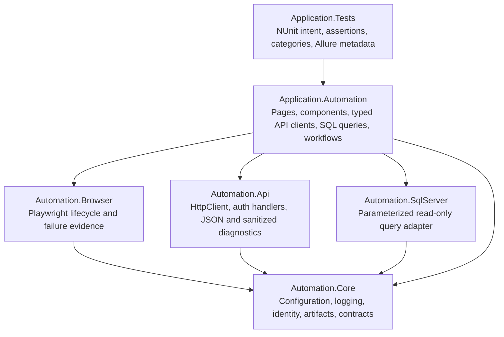

# Architecture

This template separates reusable framework mechanics from product-specific automation and test
intent. Dependencies flow downward only.

## Projects

| Project | Owns | Must not own |
|---|---|---|
| `src/Automation.Core` | Validated options, logging, run/test identity, artifact paths, redaction, common exceptions | Product selectors, endpoints, queries, assertions |
| `src/Automation.Browser` | Playwright startup, context/page per test, screenshots, traces, console capture, Page/Component base types | Business Page Objects, product assertions |
| `src/Automation.Api` | `IApiClient`, `ITokenProvider`, `BearerTokenHandler`, `ApiResponse<T>`, sanitized diagnostics | Product endpoints/DTOs, API assertions |
| `src/Automation.SqlServer` | `IReadOnlySqlClient`, `SqlQuery`, command validation, ReadOnly intent, safe evidence | DML, schema changes, product SQL, raw connection exposure |
| `src/Application.Automation` | Pages, components, typed clients, reviewed `.sql` resources, workflows | NUnit assertions, runner setup |
| `tests/Application.Tests` | Fixtures, intent, assertions, categories, Allure hierarchy, sample tests | Reusable framework mechanics |
| `tests/Automation.UnitTests` | Framework unit/structural tests (config, redaction, identity, SQL validation, path safety) | Product automation |

## Dependency rules

- `Automation.Core` never references Browser, API, SQL, application, or test projects.
- Framework projects contain no product selectors, endpoints, SQL, test intent, or assertions.
- `Application.Automation` may combine browser, API, and SQL into typed business workflows.
- `Application.Tests` owns NUnit assertions and execution metadata.
- Assertions never live in Page Objects, API clients, SQL adapters, or workflows.

## Composition

`AddAutomationCore` (options, redaction, identity, artifacts, NLog logging) is the base. Higher
layers add `AddAutomationBrowser`, `AddAutomationApi`, `AddAutomationSqlServer`, and
`AddApplicationAutomation`. `tests/Application.Tests/Framework/TestRun.cs` composes them for the
test run and pins the working directory to the repository root so `artifacts/` and
`allure-results/` resolve consistently (see [ADR 0001](decisions/0001-artifact-and-allure-layout.md)).

## Cross-cutting contracts

- **Identity** — every run has a stable `RunId`; every test a filesystem-safe `TestId`
  (`Automation.Core/Identity`).
- **Artifacts** — `artifacts/<run-id>/` holds `run-manifest.json`, `test-results.trx`, and
  `tests/<test-id>/...`; `allure-results/` is top-level and cleaned per run.
- **Redaction** — `IRedactor` masks secrets before anything reaches a log, attachment, or report.
